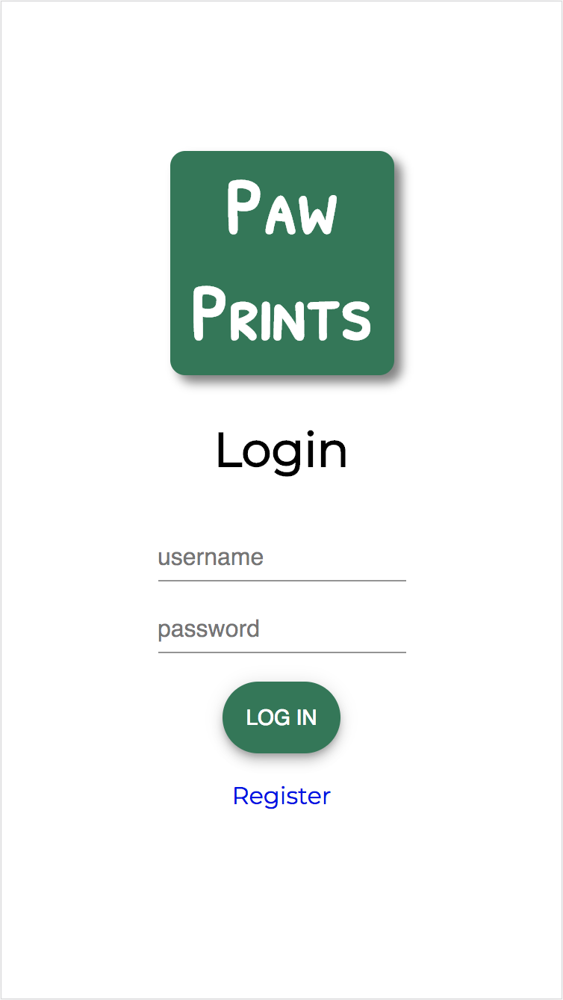
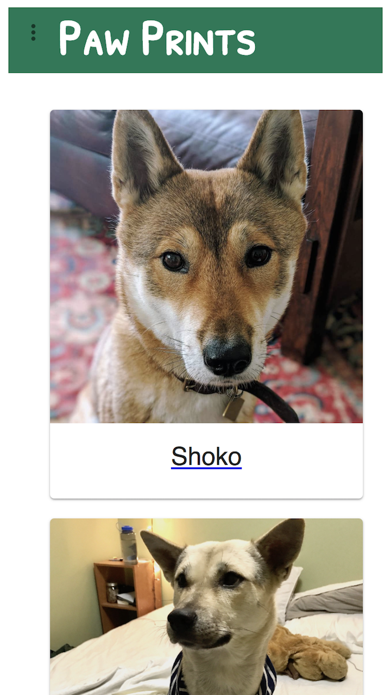
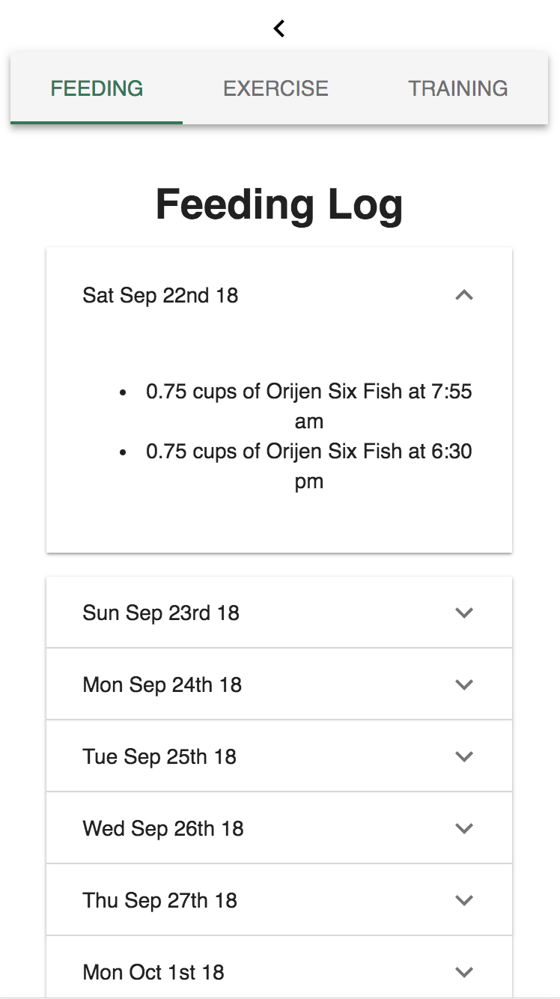
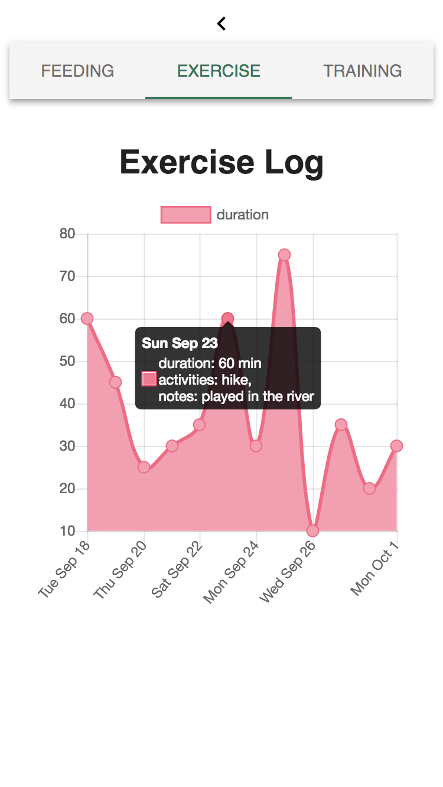

# Paw Prints

Paw Prints is a mobile-first web application built to better track, manage, and monitor various aspects of daily dog care, including feeding, training, and exercise.

## Built With

- React
- Redux
- PostgreSQL
- Node.js
- Express
- Passport.js
- Material UI

### Installing

1. Download this project.
2. Create a database on localhost called "dog-app"
3. Run `npm install`
4. Run `npm run server`
5. Run `npm run client`

## Screen Shots

Login screen:

Example dog profiles:

Example feeding logs:

Example exercise log:

### Completed Features

- [x] Create and edit dog profiles
- [x] Manage a list of foods
- [x] Manage a list of activities
- [x] Manage a list of skills
- [x] Log when dogs are fed and view that log
- [x] Log when dogs are exercised and view that log
- [x] Log when dogs are trained and view that log

### Next Steps

- [ ] Image upload for dog profile pictures
- [ ] Manage a track medications and supplements

## Authors

* Julia Balliet
